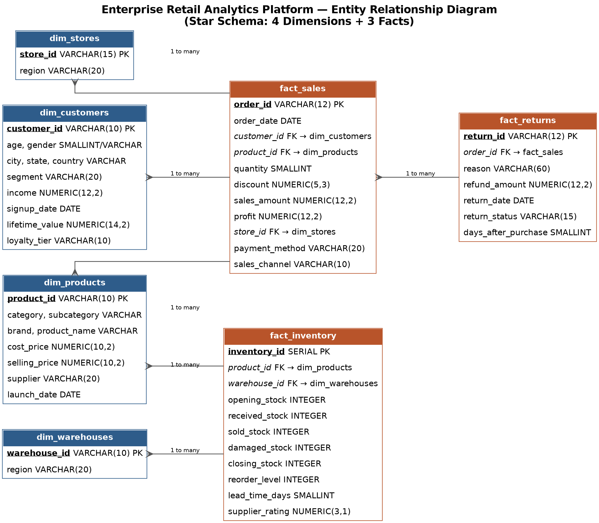
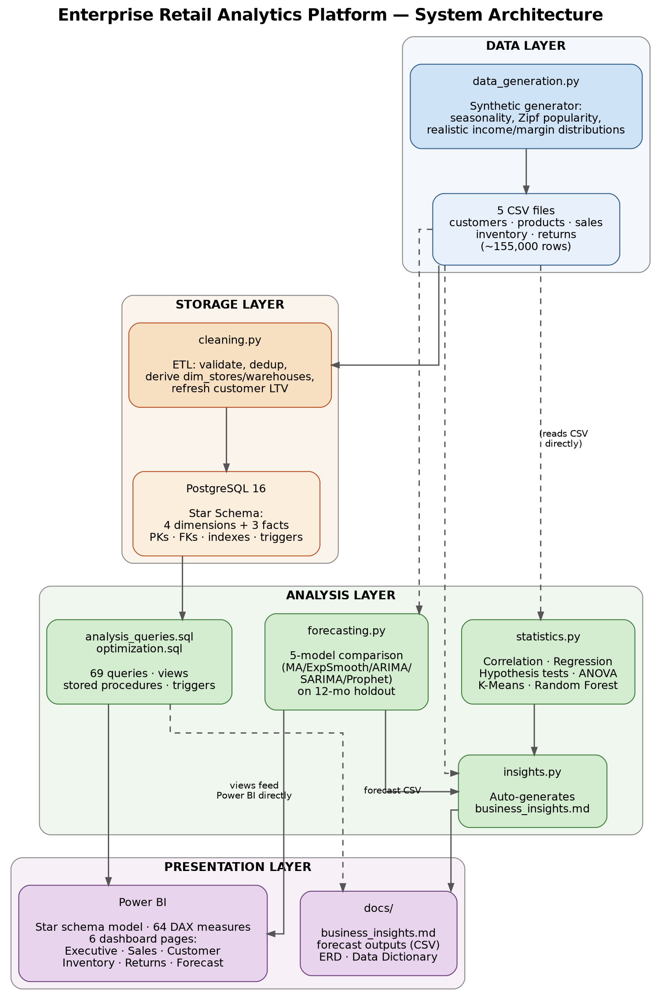

# Enterprise Retail Analytics Platform

> **A production-grade analytics system simulating the BI stack at companies like
> Walmart, Amazon, Target, Reliance Retail, Tesco, and Costco — built end-to-end
> across synthetic data generation, relational database design, advanced SQL analysis,
> statistical modelling, sales forecasting, and an executive Power BI dashboard.**

---

## Quick Stats

| Dimension | Value |
|---|---|
| Sales records | 100,000 |
| Customers | 10,000 |
| Products (SKUs) | 5,000 |
| Warehouses | 20 |
| Return records | 20,000 |
| Date range | Jan 2022 – Dec 2024 |
| Total revenue simulated | $34,190,136 |
| Total profit simulated | $3,079,723 (9.0% net margin) |
| Countries | USA, UK, India, Canada |
| SQL queries written & tested | 69 |
| DAX measures | 64 |
| Python modules | 5 |
| Lines of code | ~3,000+ |

---

## Business Problem

Large-format retailers operate across thousands of SKUs, millions of transactions, and
dozens of regions — generating more data than any human can review. The analytics
challenge isn't collecting the data; it's turning it into decisions:

- Which products are destroying margin quietly while still generating revenue?
- Which customers are about to churn, and which are worth a VIP win-back offer?
- Is a regional revenue decline seasonal noise or a structural trend?
- Which warehouses will stock out before the next purchase order arrives?
- What will next year's revenue look like, and what's the statistically honest
  confidence range around that number?

This project builds the full analytics stack to answer those questions — from raw CSV
to executive dashboard to auto-generated insight report.

---

## Architecture

```
┌─────────────────────────────────────────────────────────────────────┐
│  DATA LAYER                                                          │
│  python/data_generation.py                                           │
│  Generates 5 tables with realistic distributions:                    │
│  • Seasonal sales (Nov/Dec spike, weekday effect)                    │
│  • Long-tail product popularity (Zipf-like, needed for ABC/Pareto)  │
│  • Channel mix shifting Online over time (45% → 68%)                │
│  • Inventory stocks tied to real sales velocity                      │
│  • Returns correlated with category return-rate + discount depth     │
└──────────────────────────────┬──────────────────────────────────────┘
                               │
                               ▼
┌─────────────────────────────────────────────────────────────────────┐
│  STORAGE LAYER                                                       │
│  PostgreSQL 16 — Star Schema                                         │
│  sql/schema.sql     ← DDL: tables, PKs, FKs, indexes, constraints   │
│  python/cleaning.py ← ETL: clean, validate, bulk-load (psycopg2)    │
│                                                                      │
│  dim_customers ──┐                                                   │
│  dim_products  ──┼──► fact_sales ──► fact_returns                   │
│  dim_stores    ──┘        │                                          │
│  dim_warehouses ──────► fact_inventory                               │
│  dim_date (Power BI)                                                 │
└──────────────────────────────┬──────────────────────────────────────┘
                               │
                               ▼
┌─────────────────────────────────────────────────────────────────────┐
│  ANALYSIS LAYER                                                      │
│  sql/analysis_queries.sql  — 69 queries across 9 categories         │
│  sql/optimization.sql      — Views, SPs, Triggers, EXPLAIN plans    │
│                                                                      │
│  python/statistics.py   — Correlation, Regression, t-test, ANOVA,   │
│                           K-Means, Outlier detection, Random Forest,  │
│                           Trend analysis, Seasonal decomposition      │
│                                                                      │
│  python/forecasting.py  — MA / Exp. Smoothing / ARIMA / SARIMA /    │
│                           Prophet comparison on 12-month holdout;    │
│                           best model refit → 12-month forward cast   │
│                                                                      │
│  python/insights.py     — Auto-generates docs/business_insights.md   │
└──────────────────────────────┬──────────────────────────────────────┘
                               │
                               ▼
┌─────────────────────────────────────────────────────────────────────┐
│  PRESENTATION LAYER                                                  │
│  powerbi/data_model.md           — Star schema + M load steps       │
│  powerbi/dax_measures.dax        — 64 DAX measures                  │
│  powerbi/dashboard_specification.md — 6 dashboard pages spec        │
│                                                                      │
│  6 Dashboard Pages:                                                  │
│  Executive · Sales · Customer · Inventory · Returns · Forecast       │
└─────────────────────────────────────────────────────────────────────┘
```

---

## Project Structure

```
Enterprise-Retail-Analytics-Platform/
│
├── datasets/
│   ├── customers.csv        (10,000 rows)
│   ├── products.csv         (5,000 rows)
│   ├── sales.csv            (100,000 rows)
│   ├── inventory.csv        (~20,000 rows)
│   └── returns.csv          (20,000 rows)
│
├── sql/
│   ├── schema.sql           Star-schema DDL, PKs, FKs, indexes
│   ├── analysis_queries.sql 69 advanced queries (9 categories)
│   └── optimization.sql     Views, stored procedures, triggers, EXPLAIN
│
├── python/
│   ├── data_generation.py   Synthetic data generator (see Design Choices)
│   ├── cleaning.py          ETL: clean + PostgreSQL loader
│   ├── statistics.py        10 statistical analyses
│   ├── forecasting.py       5-model forecast comparison
│   └── insights.py          Auto-generates business insight report
│
├── powerbi/
│   ├── data_model.md        Star schema + Power Query M steps + Date dim
│   ├── dax_measures.dax     64 DAX measures (11 categories)
│   └── dashboard_specification.md  6-page dashboard spec
│   (no .pbix file — see note below)
│
├── docs/
│   ├── ERD.png                  Rendered entity-relationship diagram
│   ├── Architecture.png         Rendered system architecture diagram
│   ├── DataDictionary.md        Full column-level data dictionary
│   ├── business_insights.md     Auto-generated insight report
│   ├── forecast_model_scorecard.csv
│   ├── revenue_forecast_next_12_months.csv
│   └── diagram_sources/         Graphviz .dot source for both diagrams
│
├── dashboard_screenshots/   Empty — see its README.md for why + how to populate
├── README.md
└── requirements.txt
```

> **Note on the Power BI deliverable:** Power BI Desktop is a Windows GUI
> application and cannot be run in a Linux build/CI environment, so this
> repository ships the complete *blueprint* (data model, 64 DAX measures,
> page-by-page visual spec) rather than a compiled `.pbix` binary or
> screenshots. Anyone with Power BI Desktop can go from this blueprint to a
> working report in well under an hour — see `powerbi/data_model.md` for the
> step-by-step build guide.

---

## Documentation

| Document | Description |
|---|---|
| [docs/ERD.png](docs/ERD.png) | Entity-relationship diagram — 4 dimensions, 3 facts, full PK/FK labeling |
| [docs/Architecture.png](docs/Architecture.png) | End-to-end system architecture, layer by layer |
| [docs/DataDictionary.md](docs/DataDictionary.md) | Column-level definitions, types, constraints, and real sample values for every table |
| [docs/business_insights.md](docs/business_insights.md) | Auto-generated business insight report (see Selected Key Findings below) |

### Entity Relationship Diagram



### System Architecture



---

## Setup & Reproduction

### 1. Environment

```bash
git clone https://github.com/<your-username>/Enterprise-Retail-Analytics-Platform.git
cd Enterprise-Retail-Analytics-Platform
pip install -r requirements.txt
```

### 2. Generate Data

```bash
python python/data_generation.py
# Output: 5 CSVs in datasets/ (~155,000 rows total)
```

### 3. PostgreSQL (optional but recommended)

```bash
# Create database
createdb retail_analytics

# Apply schema
psql -d retail_analytics -f sql/schema.sql

# Load data
PGDATABASE=retail_analytics PGUSER=postgres python python/cleaning.py

# Run analysis queries
psql -d retail_analytics -f sql/analysis_queries.sql
psql -d retail_analytics -f sql/optimization.sql
```

### 4. Statistical Analysis

```bash
python python/statistics.py   # prints results + interpretations to stdout
```

### 5. Forecasting

```bash
python python/forecasting.py
# Compares 5 models, selects best, saves:
#   docs/forecast_model_scorecard.csv
#   docs/revenue_forecast_next_12_months.csv
```

### 6. Business Insights Report

```bash
python python/insights.py
# Saves: docs/business_insights.md
```

### 7. Power BI

See `powerbi/data_model.md` for step-by-step model setup (≈15 minutes).
Paste measures from `powerbi/dax_measures.dax` into the model.
Use `powerbi/dashboard_specification.md` as the visual-by-visual build guide.

---

## Key Design Choices (what separates this from a beginner project)

**Realistic data distributions, not `random.uniform()` everywhere**
- Customer income is lognormal (real income distributions are right-skewed)
- Product popularity is Zipf-like (a small set of SKUs drives most volume —
  the necessary condition for ABC/Pareto analysis to be meaningful)
- Sales seasonality is baked in at generation time (Nov/Dec spike, weekend lift,
  mid-year dip) so time-series analysis and forecasting find real signal
- Inventory stocks are computed *from actual per-product sales velocity*, not
  generated independently — so reorder alerts and turnover ratios reflect
  genuine demand, not coincidence

**Normalized database, not a flat table**
- Region is functionally dependent on Store/Warehouse, not on each transaction —
  so it's extracted into `dim_stores`/`dim_warehouses` (3NF), making the
  star schema a real one, not a "flat CSV with a primary key"
- Triggers enforce profit recomputation and inventory reconciliation at the DB layer,
  not just in application code

**Honest statistics**
- Every statistical test reports *what was actually found*, including null results
  (e.g. online vs offline order value shows **no** significant difference at p=0.24 —
  that's an honest finding, not hidden because it's less exciting)
- Forecasting uses a proper time-based train/test split (never shuffle time series)
  and the winning model (Holt-Winters, MAPE 4.81%) is chosen over Prophet and ARIMA
  because the holdout data says so, not because it's the trendy pick

**Insight report generated from data, not templates**
- `python/insights.py` computes every number at runtime — e.g. "10 Electronics
  products running net-negative profit" and "Central region declined 8.1% YoY" are
  real computed outputs, not placeholder text

---

## Selected Key Findings

| Insight | Finding | Recommended Action |
|---|---|---|
| Most profitable segment | Regular (total profit), Premium (profit per customer) | Loyalty spend should target Premium for ROI efficiency |
| Declining region | Central: -8.1% YoY in 2024 | Regional store ops + local competitive review |
| Discount damage | 26%+ discounts drive Electronics margin to -23.4% | Cap promo depth in Electronics / Grocery |
| Churn risk | 2,138 customers (21.4%) inactive 180+ days | Tiered win-back by LTV tier — not a blanket campaign |
| Discontinue candidates | 10 Electronics SKUs with net-negative profit despite real demand | Reprice or re-source — demand isn't the problem |
| Best forecast model | Holt-Winters Exponential Smoothing (MAPE 4.81%) | Use for FY2025 revenue plan with 95% CI bounds |
| Seasonality | Dec peak, Feb trough, seasonal strength 0.93 | Build staffing/inventory cycle around this, not flat monthly run-rate |
| Channel shift | Online 45% (2022) → 68% (2024) | Digital acquisition budget should grow proportionally |

---

## SQL Query Categories

| Category | Queries | Techniques Used |
|---|---|---|
| Revenue & Profitability | Q1–Q10 | Aggregation, FILTER, COALESCE, subqueries |
| Growth Analysis | Q11–Q15 | LAG, LEAD, DATE_TRUNC, YoY comparisons |
| Window Functions | Q16–Q23 | ROW_NUMBER, DENSE_RANK, NTILE, FIRST_VALUE, LAST_VALUE, running totals, moving averages |
| Customer Analytics | Q24–Q35 | CTEs, NTILE RFM scoring, cohort retention, correlated subqueries |
| Product Analysis | Q36–Q45 | ABC classification, Pareto cumulative %, CASE pivots |
| Inventory Analysis | Q46–Q53 | PERCENTILE_CONT, composite scoring, NULLIF |
| Returns Analysis | Q54–Q59 | Multi-join analysis, funnel, reason-based grouping |
| Regional/Channel | Q60–Q63 | FILTER pivots, geographic aggregation |
| Advanced SQL | Q64–Q69 | Recursive CTE date spine, correlated subqueries, EXISTS, COALESCE data quality |

---

## Statistical Analysis Summary

| Analysis | Method | Key Finding |
|---|---|---|
| Correlation | Pearson | Discount ↔ Profit: r = -0.35 (p < 0.001) |
| Regression | OLS | Discount coefficient: -382/unit (p < 0.001), R² = 0.21 |
| Hypothesis test | Welch t-test | Online vs Offline AOV: no significant difference (p = 0.24) |
| ANOVA | One-way | Order value vs Segment: no significant difference (p = 0.65) |
| Segmentation | K-Means (k=4) | 4 behavioral clusters: Champions (cluster 3), Loyal (1), Dormant (0), Lost (2) |
| Outliers | IQR + Z-score | 2,511 (Z>3) to 12,970 (IQR) anomalous orders flagged |
| Feature importance | Random Forest | SalesAmount + Discount dominate (test R² = 0.74) |
| Trend | Linear regression | No significant secular trend (p = 0.18) — business is seasonal, not growing linearly |
| Seasonality | Classical decomposition | Strength 0.93; peak Dec, trough Feb |

---

## Forecast Model Comparison (12-month holdout)

| Model | RMSE | MAE | MAPE |
|---|---|---|---|
| Moving Average | 191,887 | 162,693 | 18.95% |
| **Exponential Smoothing** | **53,628** | **44,404** | **4.81% ← Winner** |
| ARIMA | 206,111 | 171,139 | 20.03% |
| SARIMA | 83,995 | 65,217 | 6.76% |
| Prophet | 150,299 | 120,503 | 12.46% |

ARIMA performs worst because it does not model the strong seasonal component.
Exponential Smoothing (Holt-Winters) wins by capturing both trend and 12-month
seasonality directly.

---

## Future Improvements

- **Real-time pipeline**: Replace the batch CSV-based ETL with a Kafka → Flink → PostgreSQL streaming pipeline for near-real-time dashboard refresh
- **MLflow experiment tracking**: Log all 5 forecasting model runs with parameters, metrics, and artifacts so model selection is auditable and repeatable
- **Automated anomaly alerting**: Extend `python/statistics.py`'s outlier detection into a scheduled job that posts to Slack/email when a daily revenue Z-score exceeds a threshold
- **dbt transformation layer**: Rebuild the SQL views in `sql/optimization.sql` as dbt models with lineage documentation and automated tests — the natural next step for a production BI stack
- **Customer propensity models**: The K-Means RFM segmentation is descriptive; add a logistic regression churn-probability model so the win-back list is ranked by churn probability rather than a binary 180-day cutoff
- **Price elasticity analysis**: The discount-vs-profit correlation is established; extend this to a demand elasticity curve per category to set optimal discount depths programmatically

---

## Tech Stack


---

## Author

Built as a flagship portfolio project demonstrating Senior Data Analyst /
Business Intelligence Analyst skills — covering the full analytics lifecycle
from data engineering through statistical analysis, forecasting, and
executive-level dashboarding.

Suitable for roles at: top-tier technology companies, management consulting firms,
retail/e-commerce analytics teams, and enterprise BI practices.
